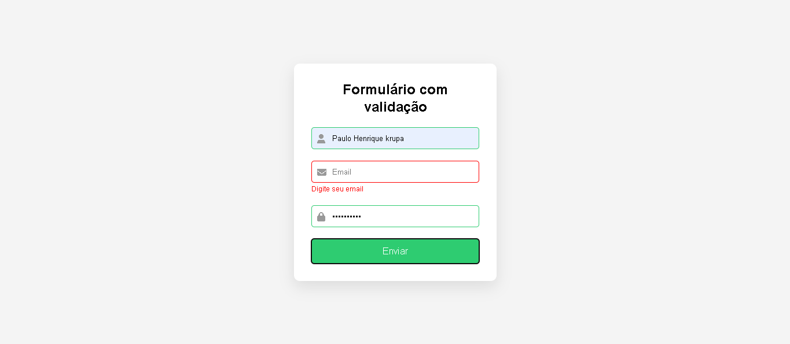

📋 Formulário com Validação em JavaScript

Este projeto é um formulário com validação desenvolvido utilizando HTML, CSS e JavaScript.  
O objetivo é validar os dados digitados pelo usuário antes do envio, garantindo que os campos estejam preenchidos corretamente.

🚀 Funcionalidades

- Validação de campos obrigatórios
- Validação de formato de e-mail
- Verificação de senha com número mínimo de caracteres
- Feedback visual nos campos (erro ou sucesso)
- Interface simples e responsiva

🛠 Tecnologias utilizadas

- HTML
- CSS
- JavaScript
- 
📸 Preview do projeto

## 🌐 Acesse o projeto online

https://paulo93-dev.github.io/formulario-validacao-js
